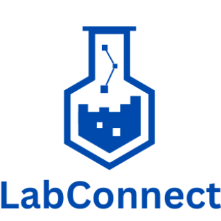

<!-- PROJECT SHIELDS -->

[![Contributors][contributors-shield]][contributors-url]
[![Forks][forks-shield]][forks-url]
[![Issues][issues-shield]][issues-url]
[![Pull Requst][pr-shield]][pr-url]
[![Activity][activity-shield]][activity-url]
[![Stargazers][stars-shield]][stars-url]


<!-- TABLE OF CONTENTS -->
<details>
    <summary> Table of Contents </summary>
    <ol>
        <li>
            <a href="#about"> About the project</a>
            <ul>
                <li><a href="#built-with">Built With</a>
            </ul>
        </li>
        <li>
            <a href="#prerequisites"> Prerequisites</a>
        </li>
        <li>
            <a href="#installation"> Installation</a>
        </li>
    </ol>
</details>


<!-- ABOUT THE PROJECT -->
## About
<div align="center">
    <a href="https://github.com/LabConnect-RCOS/LabConnect-Backend">
<!--  -->
</a>

<h3 align="center">LabConnect</h3>

<p>Connecting students to research opportunities.</p>
</div>


### Built With

[![Python][Python]][Python-url]
[![HTML][HTML]][HTML-url]
[![CSS][CSS]][CSS-url]
[![JS][JS]][JS-url]
[![Flask][Flask]][Flask-url]
[![Bootstrap][Bootstrap]][Bootstrap-url]
[![React][React]][React-url]
[![Node.js][Node.js]][Node.js-url]
[![Tailwind CSS][TailwindCSS]][TailwindCSS-url]


<!-- Getting Started -->
## Prerequisites
 * Clone
    * Clone repo through CLI
    ```bash
    $ git clone https://github.com/LabConnect-RCOS/LabConnect-Backend.git
    ```
    * or through [Github Desktop](https://desktop.github.com/)
 * Install Python 3.12.4 [here]([https://www.python.org/downloads/release/python-3122/](https://www.python.org/downloads/release/python-3124/))
 * Install Libraries 
    ```bash
    $ python3 -m pip install -r requirements.txt
    ```

## Testing
 * Run pytest
   * Run all the test files and generate a coverage report. Coverage reports are set up to output to the terminal and provide an HTML file that can be viewed to show what branches or statements are not covered. It is in the project's best interest to have high coverage to ensure all statements and branches work as expected.

   ```bash
   $ make test
   ```
   or manually
   ```bash
   $ python3 -m pytest
   ```
   or manually with a coverage report generated
   ```bash
   $ python3 -m pytest --cov
   ```

## Development
 * Run flask with python directly
   * Run all the test files

   ```bash
   $ make develop
   ```
   or
   ```bash
   $ python run.py
   ```

## Deployment
Create PRs to the main branch. Upon merging, a new Docker container will be created and pushed to the [packages for this repo](https://github.com/LabConnect-RCOS/LabConnect-Backend/pkgs/container/labconnect-backend).

## Production
Use the Docker container in the [packages tab](https://github.com/LabConnect-RCOS/LabConnect-Backend/pkgs/container/labconnect-backend). You can set these environment variables:
- SECRET_KEY
- JWT_SECRET_KEY
- FRONTEND_URL
- DB

 * Run gunicorn to test how the service runs in production
   ```bash
   $ make run
   ```
   or with Makefile
    ```bash
   $ gunicorn run:app -w 6 --preload --max-requests-jitter 300 --bind 0.0.0.0:8000
   ```

## Project Contributors

Running list of contributors to the LabConnect project:

### Project Lead

- **Rafael Cenzano** [Project Lead]

### Rensselaer Center for Open Source Development Team

- **Sarah W** [Backend]
- **Mohammed P** [Backend]
- **Will B** [Frontend]
- **Sidarth E** [Frontend]
- **Sagar S** [Frontend]
- **Gowrisankar P** [Frontend]
- **Devan P** [Frontend]


### Past Rensselaer Center for Open Source Development Team

- **Ramzey Y** [Backend] (S'24,F'24)
- **Siddhi W** [Frontend / Backend] (F'23,S'24,F'24)
- **Mrunal A** [Frontend / Backend] (F'23,S'24,F'24)
- **Abid T** [Frontend / Backend] (F'23,S'24)
- **Nelson** [Backend] (S'24)
- **Duy L** [Database Systems] (F'23)
- **Yash K** [Frontend] (F'23)
- **Sam B** [Scraping / Integration] (F'23)


### Special Thanks

We extend our special thanks support and opportunity provided by the RCOS community.

## License

Distributed under the Apache License. See [LICENSE](https://github.com/RafaelCenzano/LabConnect/blob/main/LICENSE) for more information.

<!-- https://home.aveek.io/GitHub-Profile-Badges/ -->

<!-- LINKS & IMAGES -->
[contributors-shield]: https://img.shields.io/github/contributors/LabConnect-RCOS/LabConnect-Backend.svg?style=for-the-badge
[contributors-url]: https://github.com/LabConnect-RCOS/LabConnect-Backend/graphs/contributors
[forks-shield]: https://img.shields.io/github/forks/LabConnect-RCOS/LabConnect-Backend.svg?style=for-the-badge
[forks-url]: https://github.com/LabConnect-RCOS/LabConnect-Backend/network/members
[stars-shield]: https://img.shields.io/github/stars/LabConnect-RCOS/LabConnect-Backend.svg?style=for-the-badge
[stars-url]: https://github.com/LabConnect-RCOS/LabConnect-Backend/stargazers
[issues-shield]: https://img.shields.io/github/issues/LabConnect-RCOS/LabConnect-Backend.svg?style=for-the-badge
[issues-url]: https://github.com/LabConnect-RCOS/LabConnect-Backend/issues
[pr-shield]: https://img.shields.io/github/issues-pr/LabConnect-RCOS/LabConnect-Backend.svg?style=for-the-badge
[pr-url]: https://github.com/LabConnect-RCOS/LabConnect-Backend/pulls

[activity-shield]: https://img.shields.io/github/last-commit/LabConnect-RCOS/LabConnect-Backend?style=for-the-badge
[activity-url]: https://github.com/LabConnect-RCOS/LabConnect-Backend/activity

[Python]: https://img.shields.io/badge/Python-3776AB.svg?style=for-the-badge&logo=Python&logoColor=white
[Python-url]: https://www.python.org/
[HTML]: https://img.shields.io/badge/HTML5-E34F26?style=for-the-badge&logo=html5&logoColor=white
[HTML-url]: https://html.spec.whatwg.org/multipage/
[CSS]: https://img.shields.io/badge/CSS3-1572B6?style=for-the-badge&logo=css3&logoColor=white
[CSS-url]: https://www.w3.org/Style/CSS/Overview.en.html
[JS]: https://img.shields.io/badge/JavaScript-F7DF1E?style=for-the-badge&logo=javascript&logoColor=black
[JS-url]: https://www.javascript.com/
[Flask]: https://img.shields.io/badge/Flask-000000?style=for-the-badge&logo=flask&logoColor=white
[Flask-url]: https://flask.palletsprojects.com/en/3.0.x/
[Bootstrap]: https://img.shields.io/badge/Bootstrap-563D7C?style=for-the-badge&logo=bootstrap&logoColor=white
[Bootstrap-url]: https://getbootstrap.com/
[React]: https://img.shields.io/badge/React-61DAFB?style=for-the-badge&logo=react&logoColor=black
[React-url]: https://reactjs.org/
[Node.js]: https://img.shields.io/badge/Node.js-43853D?style=for-the-badge&logo=node.js&logoColor=white
[Node.js-url]: https://nodejs.org/
[TailwindCSS]: https://img.shields.io/badge/Tailwind_CSS-38B2AC?style=for-the-badge&logo=tailwind-css&logoColor=white
[TailwindCSS-url]: https://tailwindcss.com/
