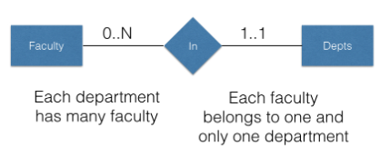

## ENTITY-RELATIONSHIP DIAGRAMS

Entity-relationship (ER) modeling is a non-standardized method for designing databases. It helps give the high-level view of the whole database. These diagrams have entities and relationships. ER diagrams are highly iterative, visual, and object oriented. Data modeling is both a science and an art.

**Entities**

They are **classes of objects** that we are storing. The names of entities are usually nouns and plural. They contain attributes.

**Each entity must have a key.** Strongly prefer a **natural key** rather than synthetic, and synthetic keys are only introduced as necessary.

Each entity should preferably be in **Boyce-Codd Normal Form (BCNF)**, or at least in **Third Normal Form (3NF)**. 

Drawing entities: usually rectangles.

**Entity Attributes**

Entities contain attributes. All attributes must be simple, and must only characterize the entity it belongs to. 

Hint: introducing more attributes may mean adding more functional dependencies, which may break the normal forms (BCNF or 3NF) of the entity

Drawing attributes: Usually ellipses. Connected to the entities via straight lines. Attributes that belong to a key are underlined. 

**Should it be an attribute or an entity?** 

Attributes characterize entities. If something doesn’t characterize an entity, it should be a weak entity, even if it seems to be an attribute! See below for weak entities.

**Relationships**

Relationships define how entities are linked to each other. See a verb? It’s a relationship

**Binary relationships** connect 2 entities, and they’re the most common. Relationships between more than 2 entities are not common.

Some relationships have participation constraints: 1 entity can only relate to n instances of another entity.

* Cardinality: number of instances of another entity that 1 entity can relate to.

* One-to-many: 1 entity relates to many entities. One-to-One: 1 entity relates to only 1 entity. 

* Many-to-many: many entities relate to many entities.

* Recursive relationships: connect from one instance of an entity to another instance of the same entity.

**Relationship attributes:** Relationships may have from 0 to many attributes, which should characterize the relationship. Relationships have no key.

Drawing Relationships: Usually diamonds. Connected to the entities via straight lines. The name of the relationship should feel natural. Participation constraints are drawn next to the line, or represented as some form of arrowhead.

Example:

**Ternary relationships:** are between three separate entities. When deciding the participation constraints, consider pairs of attributes: For a specific A and B, there are 0,1,..N Cs.

**Weak entities:** A weak entity has a key and a set of attributes. The key of a weak entity is not guaranteed to be unique in the database, thus it needs support.

**Supporting entities:** support a weak entity with many-weak-entity-to-one-supporting-entity relationships.

* The key of all supporting entities combined with the key of the weak entity is guaranteed to be unique in the database. 

* The supporting entities connect to the weak entity by supporting relationships, drawn with two lines around them.

Example: Tracks is a weak entity, while Album supports Tracks via “IsPartOf” relationship.

**Entity subclasses:** Entities of similar types can be organized in a type hierarchy. The key and all other attributes are inherited from the parent.

## ER DIAGRAMS AND RELATIONAL MODEL

Mapping an entire ER Diagram to a bunch of relations should have an order to make it easy.

1. Convert entities to relational model

2. Convert weak entities to relational model

3. Convert relationships based on cardinality

4. Convert entity hierarchies to relational model

In detail:

1. Convert entities to relational model

Each entity corresponds to a relation: Map entity name as relation’s name. Map entity keys as the relation’s key. Map all other attributes as attributes of the relation.

2. Convert weak entities to relational model

Each weak entity and all supporting relationships together are mapped to a new relation. 

* The relation must have the same name and all attributes of the weak entity, and...

* The key of the relation is the union of the weak entity key and the key of all the supporting entities.

For example: If Album (key: AlbumId) supports Tracks (weak key: TrackId, other attributes), then the final relation is Tracks(AlbumId, TrackId, other attributes), key: (AlbumId TrackId)

3. Convert relationships based on cardinality

**One-to-many:** Map to the entity on the “many” side so that the entity on the “many” side has keys of the “one” side included in its set of attributes.

For example: If one B to many As: 
A(keyforA, attributesforA, keyforB) Key: keyforA 
B(keyforB, attributesforB) Key: keyforB

**One-to-one:** either entity can have the key of the other side included in its set of attributes, but if one side can have cardinality of always 1, give the key to the other.

**Many-to-many:** must be mapped to a new relation. Create a new relation R: include in R the keys of all joining entities. The key must include the keys of all entities that have an N participation.

Add **relationship attributes** as attributes to the relation that the relationship was mapped to.

4. Convert entity hierarchies to relational model

Given a parent entity and subclass entities:

Option 1: Convert each subclass entity to a separate relation (if the hierarchy is covering, then the parent entity does not need a separate relation)

* Pros: Precise. Cons: Multiple entities copy the same information

Option 2: Convert the parent entity to its relation and then create a new relation for each subclass, only listing the unique attributes

* Pros: No repeated tuples. Cons: Need a lot of joins to get the same info

Option 3: Flatten and create a single entity for the whole hierarchy. We need an attribute(s) to identify the class(es) the entity belongs to.

* Pros: No additional joins. Cons: Waste space with lots of empty attributes; not elegant; not modular.

